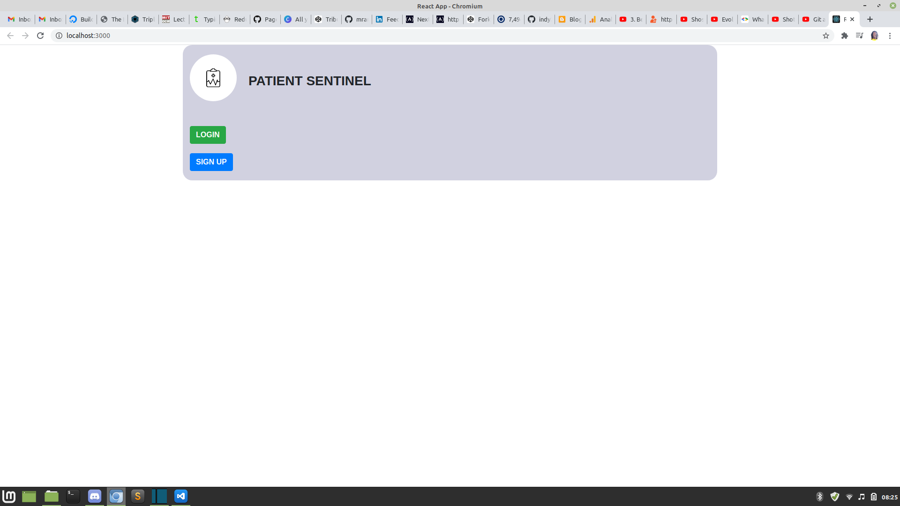
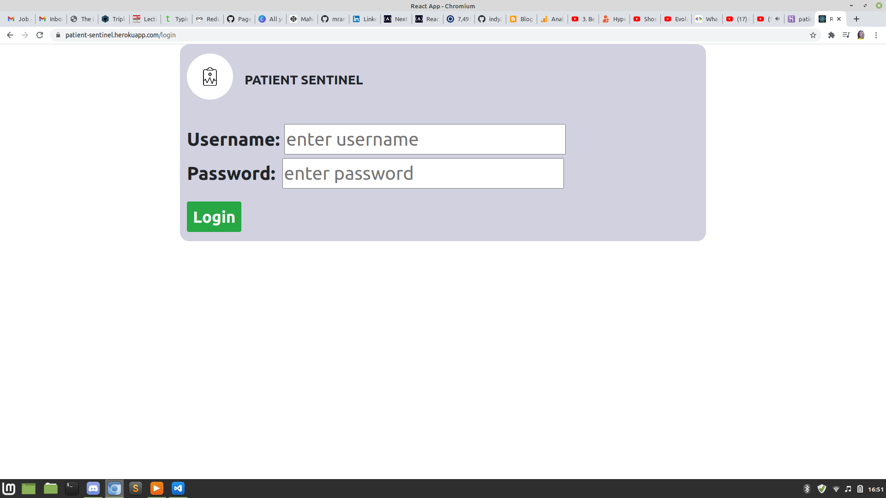
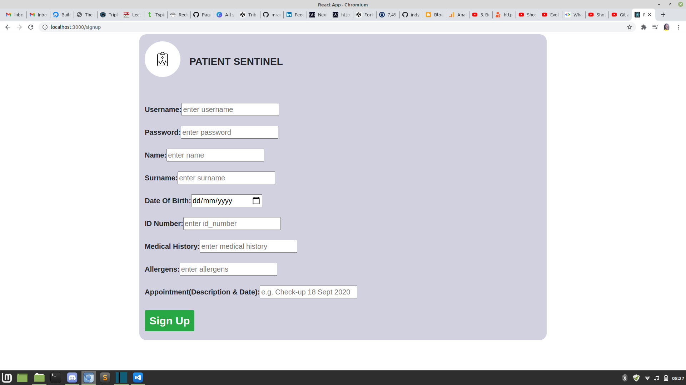
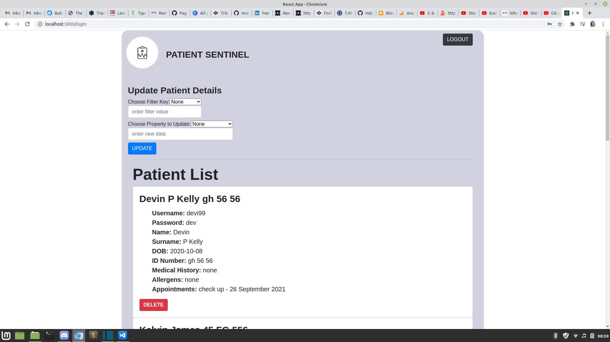
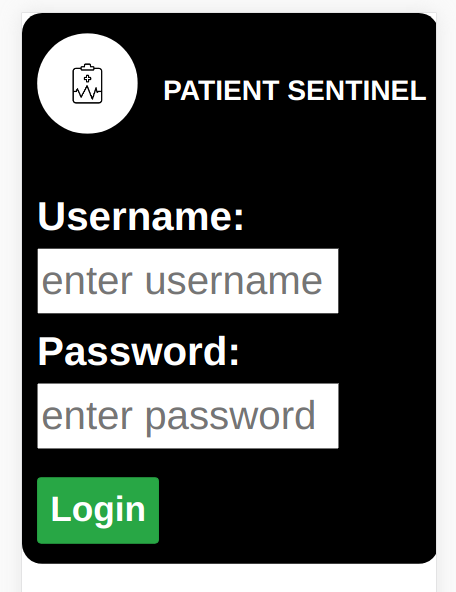
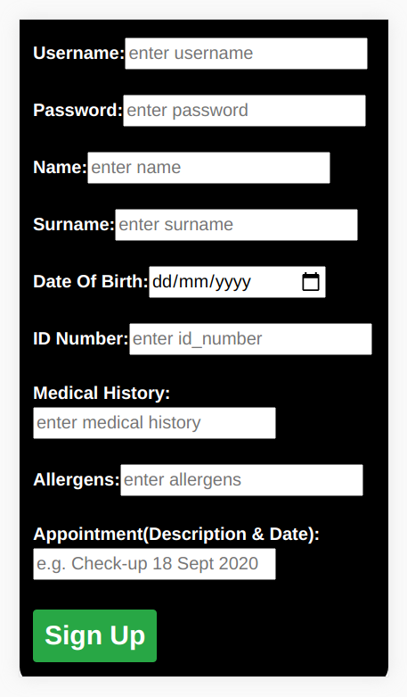

# The Patient Sentinel
The Patient Sentinel is user-admin access application that allows doctors to keep track of and edit patient information in a database. Users/patients have read-only access and are thus only able to view their appointments

### installation
* clone repository as is
* navigate to the repository's root folder in your Command-Line Interface(CLI) 
* use *npm install* in your CLI to install dependencies
* while still in the root folder, use *npm start* to start up the server.
* open the client directory in your CLI and use *npm install* to install dependencies
* then, still in the client directory in your CLI, use *npm start* to run the application

### Functionality
* The landing page will have two options: LOGIN & SIGN UP
* if you choose to SIGN UP, you will be redirected to the sign up page
* in the sign up page, various input fields will be available to receive your information. After you've entered your patient information, simply click sign up and then login to view your appointment
* if you choose LOGIN, you will be directed to a login page where you enter your username and password 
* the admin username and password combination is *{Admin: boss55}*. logging in as admin allows for editing of all the patients' information
* logging in as an ordinary user on allows for read-only access 
* There are four environmental varaibles: DB_, DB_USER, DB_PASS and KEY_JWT. Simply create a .env file and set the DB_USER to your MongoDB username, DB_PASS to your MongoDB password and DB_ to the name of the database you want to connect to. You can set the value of KEY_JWT to anything

### User Interface

#### DESKTOP

#### MOBILE

### Security
* Helmet has been used to secure the custom server
* Environmental variables have been used to abstract sensitive information from the codebase

### Authors
Mahamo Ranoka
